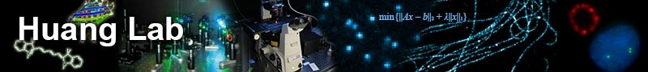
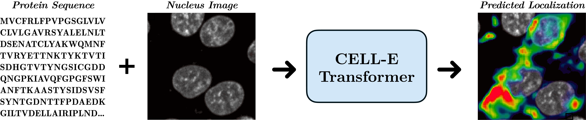

<p>
<center>

  </center>
</p>

# CELL-E: Biological Zero-Shot Text-to-Image Synthesis for Protein Localization Prediction

This repository is the official implementation of [CELL-E: Biological Zero-Shot Text-to-Image Synthesis for Protein Localization Prediction](https://www.biorxiv.org/content/10.1101/2022.05.27.493774v1). 



<p>
<center>

  </center>
</p>


## Requirements

Create a virtual environment and install the required packages via:

```setup
pip install -r requirements.txt
```

Next, install ```torch = 1.7.1``` and ```torchvision==0.8.2``` with the [appropriate CUDA version](https://pytorch.org/get-started/previous-versions/#v171) 

## Preparing Dataset

### Images

We used OpenCell for CELL-E, which has [information on downloading the entire dataset](https://opencell.czbiohub.org/download). A ```data_csv``` is needed to for the dataloader. You must generate a csv file which contains the columns ```nucleus_image_path```, ```protein_image_path```, ```metadata_path```, and ```split``` (train or val). It is assumed that this file exists within the the same general ```data``` folder as the images and metadata files.

### Metadata

Metadata is a JSON which should accompany every protein sequence. If a sequence does not appear in the ```data_csv```, it must appear in ```metadata.json``` with the a key named ```protein_sequence```.

Adding more information here can be useful for querying individual proteins. They can be retrieved via ```retrieve_metadata```, which creates a ```self.metadata``` variable within the dataset object.

## Training

Training for CELL-E occurs in 2 (or 3) stages:

- Training Protein Threshold Image encoder
- (Optional, but recommended) Training a Nucleus Image (Conditional Image) Encoder
- Training CELL-E Transformer 

### Image Encoders

There are two available image encoders in this repository: Discrete VAE (Similar to the original OpenAI implementation) and VQGAN (recommended). If using the protein threshold image, set ```threshold: True``` for the dataset.

#### Discrete VAE

The discrete VAE can be trained using the following code:

```python
from celle import DiscreteVAE

vae = DiscreteVAE(
    image_size = 256,
    num_layers = 3,           # number of downsamples - ex. 256 / (2 ** 3) = (32 x 32 feature map)
    channels = 1,
    num_tokens = 512,        # number of visual tokens. in the paper, they used 8192, but could be smaller for downsized projects
    codebook_dim = 512,       # codebook dimension
    hidden_dim = 64,          # hidden dimension
    num_resnet_blocks = 1,    # number of resnet blocks
    temperature = 0.9,        # gumbel softmax temperature, the lower this is, the harder the discretization
    straight_through = False, # straight-through for gumbel softmax. unclear if it is better one way or the other)

loss = vae(images, return_loss = True)
loss.backward()
```

#### VQGAN (Recommended)

We use a slightly modified version of the [taming-transformers](https://github.com/CompVis/taming-transformers) code.

To train, run the following script:

```python celle_taming_main.py --base configs/threshold_vqgan.yaml -t True```

Please refer to the original repo for additional flags, such as ```--gpus```. 


### CELL-E

To train, run the following script:

```python celle_main.py --base configs/celle.yaml -t True```

Specify ```--gpus``` in the same format as VQGAN.

CELL-E contains the following options from [dalle-pytorch](https://github.com/lucidrains/DALLE-pytorch).

- ```ckpt_path``` : Resume previous CELL-E training. Saved model with state_dict
- ```vqgan_model_path``` : Saved protein image model (with state_dict) for protein image encoder 
- ```vqgan_config_path```: Saved protein image model yaml
- ```condition_model_path``` : (Optional) Saved condition (nucleus) model (with state_dict) for protein image encoder 
- ```condition_config_path```: (Optional) Saved condition (nucleus) model yaml
- ```num_images```: 1 if only using protein image encoder, 2 if including condition image encoder
- ```image_key```: ```nucleus```, ```target```, or ```threshold```
- ```dim```: Dimension of language model embedding (768 for BERT)
-  ```num_text_tokens```: total number of tokens in language model (30 for BERT)
-  ```text_seq_len```: Total number of amino acids considered


-  ```depth```: Transformer model depth, deeper is usually better at the cost of VRAM
-  ```heads```: number of heads used in multi-headed attention
- ```dim_head```: size of attention heads
- ```reversible```: See [https://github.com/lucidrains/DALLE-pytorch#scaling-depth](https://github.com/lucidrains/DALLE-pytorch#scaling-depth)
- ```attn_dropout```: Attention Dropout rate in training
- ```ff_dropout```: Feed-Forward Dropout rate in training
- ```attn_types```: See [https://github.com/lucidrains/DALLE-pytorch#sparse-attention](https://github.com/lucidrains/DALLE-pytorch#sparse-attention). Sparse attention not supported
- ```loss_img_weight```: Weighting applied to image reconstruction. text weight = 1
- ```loss_cond_weight```: Weighting applied to condition image reconstruction.
- ```stable```: Norms weights (for when exploding gradients occur)
- ```sandwich_norm```: See [https://github.com/lucidrains/x-transformers#sandwich-norm](https://github.com/lucidrains/x-transformers#sandwich-norm)
- ```shift_tokens```: Applies shift in feature dimension. Only applied to images.
- ```rotary_emb```: [Rotary embedding](https://github.com/lucidrains/x-transformers#rotary-positional-embeddings) scheme for positional encoding
- ```text_embedding```: language used for model. ```no_text```, ```unirep```, ```bert```, ```esm1b```, ```onehot```, ```aadescriptors``` available
- ```fixed_embedding```: Setting to ```True``` allows for protein sequence embeddings to be updated during training
- ```learning_rate```: Learning rate for Adam optimizer
- ```monitor```: Param used to save models

## Generating Images

To generate images, set the saved model as the ckpt_path. This method can be unstable, so refer to ```Demo.ipynb``` to see another way of loading.

```python
import OmegaConf
from celle_main import instantiate_from_config

configs = OmegaConf.load(configs/celle.yaml);

model = instantiate_from_config(configs.model).to(device);

model.generate_images(text=sequence,
                      condition=nucleus,
                      return_logits=True,
                      progress=True,
                      use_cache=True)
```

## Citation

Please cite us if you decide to use our code for any part of your research.
```
CELL-E: Biological Zero-Shot Text-to-Image Synthesis for Protein Localization Prediction
Emaad Khwaja, Yun S. Song, Bo Huang
bioRxiv 2022.05.27.493774; doi: https://doi.org/10.1101/2022.05.27.493774
```

## Acknowledgements

Huge shoutout to [@lucidrains](https://github.com/lucidrains) for putting out [dalle-pytorch](https://github.com/lucidrains/DALLE-pytorch), which this code is based on. This work would not have been possible without the invaluable contribution.
